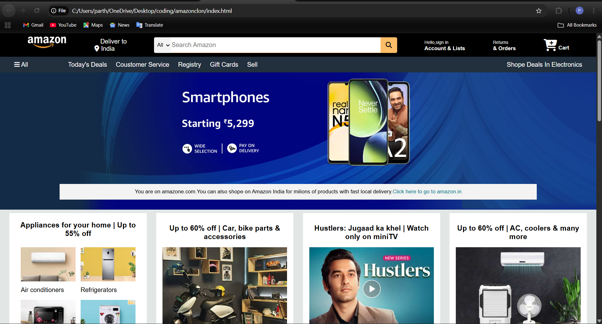

# Amazon Clone (Frontend)

This project is a **frontend clone of the Amazon website**, built using **HTML and CSS**.  
It replicates the look and feel of the Amazon homepage with a focus on **UI/UX design**.

---

## Features
- Responsive navigation bar with logo, search bar, and cart
- Sign-in dropdown with account and list options
- Product showcase sections with categories and deals
- Hero section with promotional banner
- Footer with useful links and information
- Styled using pure **CSS** (no frameworks used)

---

## Tech Stack
- **HTML5**
- **CSS3**
- **Font Awesome (icons)**

---

## Preview
  
